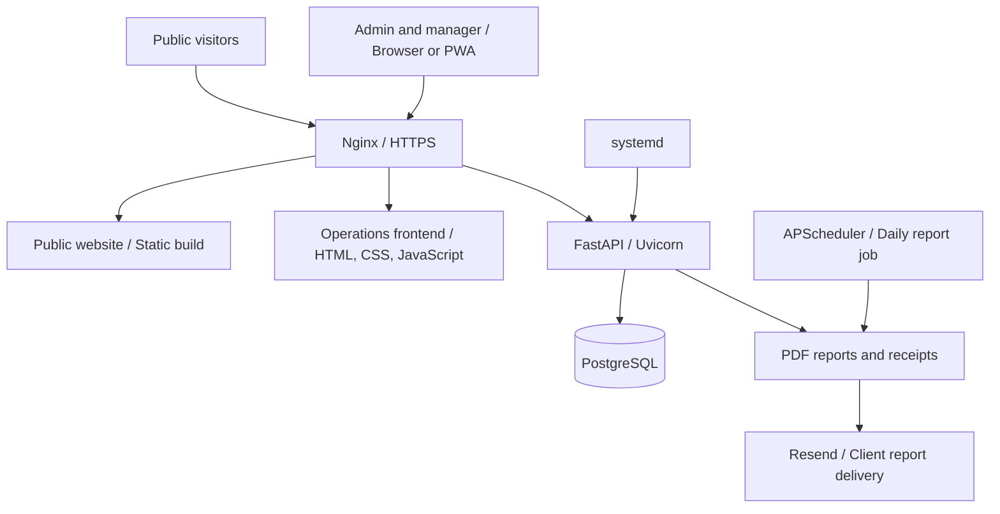

<div align="center">


# NEO BRICKS
### Factory Operations Platform & Client Website

A client project bringing production, inventory, sales and daily reporting into one web application for a fly ash brick manufacturer in Palakkad , Kerala.

**Python · FastAPI · PostgreSQL · JavaScript · PWA · Nginx · Linux**

[Public Website](https://neobrickskerala.com/) · [Client App — Login Required](https://neobricks.online/) · [Architecture & Delivery](docs/PROJECT_SHOWCASE.md) · [Database Setup](brickfactory/DATABASE_SETUP.md)

</div>

---

## Project overview

Built for **NEO BRICKS**, this project connects the factory's day-to-day operations with the information the owner needs to review the business. Managers can record production and sales; administrators can manage material rates, recipes and charges, review stock and costs, and configure daily reports.

The delivery also includes a separate public website and a migration from Raspberry Pi hosting to a Hostinger VPS. The business application and marketing website share the server but use separate domains and web-server configurations.

**Developer:** [zac-tec](https://github.com/zac-tec)

**Project type:** Client delivery · Full-stack web application · Deployment & operations

**Access:** The public website is open to visitors. The operations app is a client system, not an open demo; no demonstration credentials or client records are provided.

## What the application does

| Area | Capabilities |
| --- | --- |
| Production | Daily production entry and preview, material consumption and production history |
| Inventory | Raw-material refills, stock visibility, brick batches and finished-stock adjustments |
| Sales | Brick sales, printable PDF receipts, customer lookup and purchase history |
| Cost management | Material rates, recipes, making charges, fixed overheads and historical cost snapshots |
| Planning | Material requirements for orders and production capacity estimates |
| Reporting | Production and sales trends, cost breakdowns, estimated profit and downloadable daily PDFs |
| Email delivery | Branded reports through Resend, manual sending and a configurable daily schedule |
| Access control | Admin and manager permissions, bcrypt password hashes and JWT authentication |
| Active users | An administrator panel based on recent authenticated heartbeats |
| Mobile access | Responsive interfaces, installable PWA assets and fullscreen/standalone display preferences |

Profit figures are application estimates based on the recorded inputs. Active-user counts represent recent activity rather than an exact count of people looking at the screen.

## Architecture



The public website uses **React, TypeScript and Vite**, exported as static files. The operations frontend uses **HTML, CSS and JavaScript** backed by FastAPI. Both applications are included: `brickfactory/` contains the operations app and [`website/`](website/) contains the public website source.

## Engineering decisions

- **Separate responsibilities:** Routers handle business areas; shared services, authentication, costing and reporting live in dedicated modules.
- **Database migrations:** Fresh installation and restoration follow different paths, preserving an existing database instead of rebuilding it with the initial schema.
- **Historical costing:** Cost snapshots and rate history help retain the context of earlier production records when current rates change.
- **Same-origin deployment:** Nginx serves the interface and routes API requests, keeping the browser integration straightforward.
- **Single application process:** The report scheduler and active-user presence are process-local. Multiple workers require scheduler coordination and shared presence storage.
- **Independent public website:** Marketing updates can be deployed without restarting the factory application.

## Deployment scope

The delivered setup includes a Linux VPS, Nginx HTTPS virtual hosts, a systemd-managed application, PostgreSQL, domain configuration and automated certificate renewal. The migration and hardening work included SSH key access, firewall rules and login-abuse protection.

These describe the delivered deployment, not infrastructure automatically created by cloning this repository. Live server settings, credentials and backup contents are maintained outside the public source tree. See the [project case study](docs/PROJECT_SHOWCASE.md) for the delivery workflow and operational considerations.

## Repository map

```text
.
├── README.md
├── website/                     # Public React/TypeScript website
├── docs/
│   └── PROJECT_SHOWCASE.md       # Delivery story and architecture notes
└── brickfactory/
    ├── main.py                  # FastAPI entry point
    ├── routers/                 # Authentication and business endpoints
    ├── services.py              # Shared business and database operations
    ├── schemas.py               # Request/response models
    ├── batch_stock.py           # Finished-brick stock handling
    ├── cost_history.py          # Historical cost handling
    ├── pdf_generator.py         # Reports and receipts
    ├── email_sender.py          # Resend integration
    ├── scheduler.py             # Scheduled report delivery
    ├── frontend/                # Admin/manager pages, scripts and PWA assets
    ├── schema.sql               # Initial database structure
    ├── migration_*.sql          # Ordered schema changes
    ├── database_setup.sh        # Fresh / restore setup workflow
    ├── provision_user.py        # Interactive account provisioning
    ├── tests/                   # Database, HTTP security and presence checks
    └── .env.example             # Configuration template
```

## Run the public website

```bash
cd website
npm ci
npm run dev
```

Use Node.js 22.13 or newer. `npm run build` produces the static website in `website/static-dist/`. See [website/README.md](website/README.md) for editing and publishing instructions.

## Local backend setup

Prerequisites: Python with virtual-environment support, PostgreSQL and its command-line tools, and Git. Use a separate development database.

```bash
git clone https://github.com/zac-tec/PROJECT_1.git
cd PROJECT_1/brickfactory
python3 -m venv .venv
source .venv/bin/activate
pip install -r requirements.txt
cp .env.example .env
```

1. Fill in your development database settings and a strong `JWT_SECRET_KEY` in `.env`.
2. Follow [DATABASE_SETUP.md](brickfactory/DATABASE_SETUP.md) to initialize an **empty** database or migrate a separate restored copy. Do not run the fresh schema against an existing client database.
3. Provision your own admin and manager accounts using `provision_user.py` and its interactive password prompt.
4. If email reporting is needed, configure your own Resend key and sender, then set the recipient and schedule in the app. Use a verified sender domain for client delivery.
5. Start the backend:

```bash
uvicorn main:app --host 127.0.0.1 --port 8000 --reload
```

Backend health: `http://127.0.0.1:8000/health`

API documentation: `http://127.0.0.1:8000/docs`

The production frontend expects same-origin API routes (`API_BASE` is empty). To run the full interface locally, configure a local reverse proxy that serves `frontend/` and forwards API routes to Uvicorn, or explicitly configure the frontend API base and `CORS_ALLOWED_ORIGINS` for your local origins. The backend command alone does not serve the frontend pages.

## Verification and operating limits

The repository includes checks for HTTP error handling, authenticated presence access and isolated database setup. Database verification must use a disposable database; instructions are in [DATABASE_SETUP.md](brickfactory/DATABASE_SETUP.md#isolated-verification).

- Business operations require a running backend and database; PWA installation does not make transactions offline-capable.
- The report job depends on the application running, the server timezone, delivery settings and the email provider. Missed sends need operational follow-up.
- Backups should be encrypted where appropriate, retained off-server and periodically restored into an isolated database. A successful upload alone does not demonstrate recoverability.
- HTTPS, authentication and firewall controls reduce exposure; ongoing updates and monitoring remain necessary.

## Portfolio scope

This project demonstrates business-workflow implementation, relational data modelling, role-based interfaces, PDF/email automation, mobile web delivery, server migration and a client-facing website redesign. It is presented as a client delivery without invented usage figures, cost savings or uptime guarantees.

Client branding and photographs remain associated with NEO BRICKS. Public visibility of this repository does not grant rights to reuse the client's identity or data. No new software licence is asserted by this showcase.
