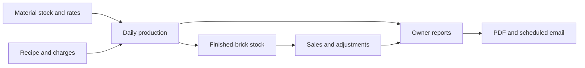

# NEO BRICKS — Client project case study

## The brief

Deliver a web-based operations system for a fly ash brick factory, support owner and manager workflows, and provide a professional public website. The solution needed to cover more than a landing page: daily business entries, inventory, costing, sales, reports and the infrastructure that keeps the application available.

## The workflow

The manager-facing workflows support operational entries. The administrator-facing workflows provide configuration, planning and business review. Shared authentication and role checks control access to the relevant endpoints.

## Delivery journey

### 1. Factory operations

Production, raw materials, brick stock, sales and costing are represented in a PostgreSQL-backed FastAPI application. The browser interface separates administrator and manager responsibilities. PDF generation supports daily reports and sales receipts.

### 2. Reporting and mobile access

Resend delivers branded reports, with the recipient and schedule controlled through application settings. The PWA manifest, icons and service worker support installation and an app-like presentation on supported browsers. Authenticated heartbeats provide a recent-active-users view for the administrator.

### 3. Raspberry Pi to VPS

The deployment moved from a Raspberry Pi to a Hostinger VPS. The migration work covered the application runtime, database restoration/migrations, domains, HTTPS and service management. The production database remains private; SQL structure and migrations are source-controlled separately from operational records.

### 4. Public website and client feedback

Three initial design directions were prepared for review. The selected Rooted direction evolved into a warmer industrial design using the client's brick and production-yard photographs. Feedback led to rectangular imagery, stronger upright headings and retention of the green, cream and terracotta palette.

The website includes product information, sourced fly ash brick benefits, a laboratory-report link, FAQs and contact actions. It is hosted separately from the factory app. Temporary design sites were retired and their addresses redirect to the finished website.

## Deployment boundaries

| Component | Responsibility |
| --- | --- |
| `neobrickskerala.com` | Public factory website, exported static assets |
| `neobricks.online` | Authenticated operations app |
| Nginx | HTTPS termination, static serving and API proxying |
| FastAPI / Uvicorn | Business API and background report scheduler |
| PostgreSQL | Application records and configuration |
| systemd | Application process lifecycle |
| Resend | Outbound report delivery |

The public website source is maintained separately from the application code in this repository. The live links show the deployed experiences; they do not grant access to the client's private workspace.

## Backup and recovery model

Recovery has three separate needs: application source, database structure and database values. Git covers source and schema changes; off-server database dumps cover operational data. Private configuration, provider access and recovery instructions must also be recoverable by the authorised operator.

The project discussion included scheduled database backups to Google Drive. This repository does not ship that live cron configuration or assert its current execution status. Backup frequency, retention, encryption and restore drills must be verified in the deployment itself.

## What this project demonstrates

- Translating factory operations into connected application workflows.
- Modelling stock, costs, production and sales in a relational database.
- Implementing separate administrator and manager experiences.
- Generating business PDFs and scheduling email delivery.
- Migrating an application between different server environments.
- Managing HTTPS domains and independently deployed applications on one VPS.
- Iterating a public website from client feedback through to release.

## Continuing improvements

Useful future work includes a sanitised demonstration dataset, automated build/test checks, dependency version pinning, broader workflow tests and automated restore verification. Shared job coordination and presence storage would be needed before scaling to multiple application workers.

No production data or authenticated dashboard screenshots are included in this public case study.
